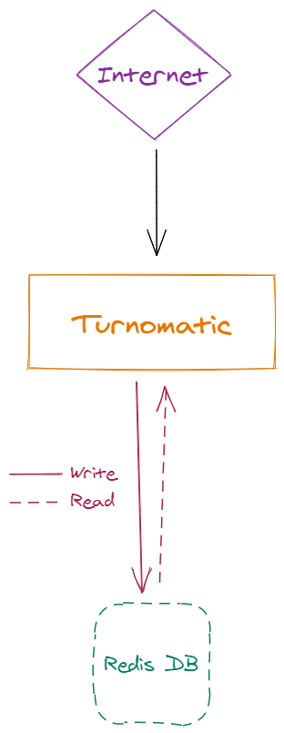
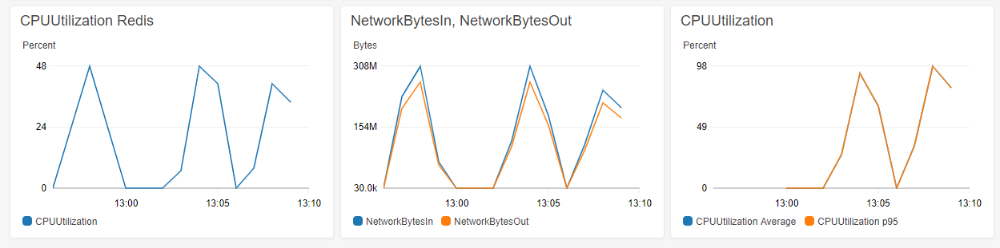
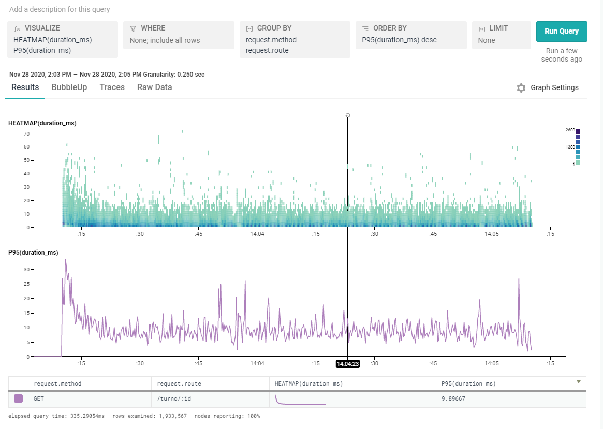
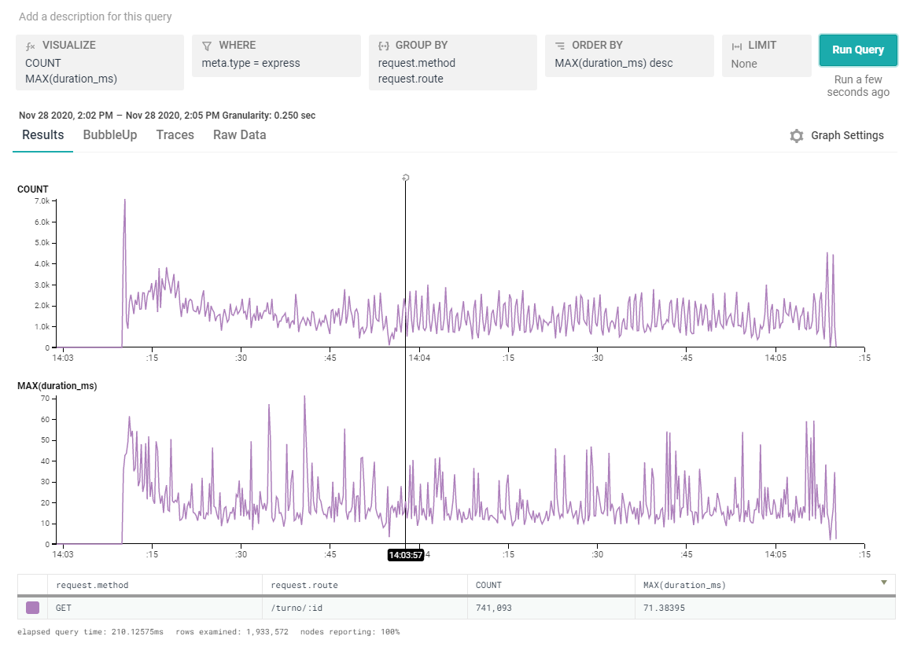

# Prueba cambio de arquitectura

Partiendo de las acciones a llevar a cabo descritas en el ultimo [informe de incidentes]("./incidente_sobrecarga.md"), se ha llevado a cabo una prueba de concepto consistente en un cambio de arquitectura y configuracion del sistema con el objetivo de:

- Comprobar sí el balanceador de carga introduce sobrecarga en los tiempos de respuesta del sistema
- Intentar aumentar el número de peticiones por segundo que el sistema puede soportar

# Nueva Arquitectura

- Se ha eliminado el balanceador de carga
- Se ha creado un único nodo web con las siguientes caracteristicas:
    - Nombre comercial de instancia AWS: _m5.8xlarge_
    - Procesador: 32 cores 
    - Memoria: 128 GB
    - Sistema Operativo: Ubuntu
    - Almacenamiento: 8 GB

> Coste estimado mensual: 716.64 USD

## Pruebas de carga

### Prueba sin balanceador

`autocannon -c 100 -d 120 -p 10 http://turnomatic.com/turno/g4`

|Stat|1%|2.5%|50%|97.5%|Avg|Stdev|Min|
|-|-|-|-|-|-|-|-|
|Req/Sec|29455|36767|57855|58719|56917.34|4488.94|26622

**AWS monitoring**

**Honeycomb results**

### Prueba con balanceador

`autocannon -c 100 -d 120 -p 10 http://turnomatic.com/turno/g4`

|Stat|1%|2.5%|50%|97.5%|Avg|Stdev|Min|
|-|-|-|-|-|-|-|-|
|Req/Sec|27423|32367|45631|48031|44951.34|3288.39|26094

# Conclusiones

- Existen diferencias significativas entre las pruebas con la arquitectura iniciar, y las pruebas añadiendo un balanceador de carga en la arquitectura. Por lo que podemos concluir que **el balanceador de carga configurado en AWS introduce un _cuello de botella_ en el sistema, limitando el número de peticiones por segundo que se pueden atender**

- Además, al utilizar un tipo de instancia de máquina virtual más potenten en cuanto a capacidad de CPU, podemos observar un incremento sustancia en el parametro de _request per second_ de los test de carga, **Llegando a resultados de alrededor de las 60k peticiones por segundo atentididas**.

