# Incidente de sobrecarga

Según el sistema de alertas configurado en AWS, se informa de que existe un consumo de CPU alto en las instancias de nuestro sistema Turnomatic.

Esto ha producido una bajada de rendimiento en el sistema, incrementando el tiempo de respuesta de cada llamada HTTP.

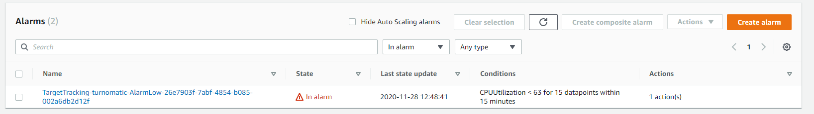

## Prueba de carga

Utilizando la libreria [autocannon](https://github.com/mcollina/autocannon) para realizar pruebas de carga en nuestro sistema, obtenemos el siguiente resultado:

`autocannon -c 100 -d 240 -p 10 http://turnomatic.com/turno/g4`

|Stat|1%|2.5%|50%|97.5%|Avg|Stdev|Min|
|-|-|-|-|-|-|-|-|
|Req/Sec|2285|2285|5803|6123|5415.24| 937.97|2285


Los resultados con la libreria [loadtest](https://github.com/alexfernandez/loadtest) son:

`loadtest -c 100 -t 240 http://turnomatic.com/turno/g4`

```
INFO Target URL:          http://turnomatic.com/turno/g4
INFO Max time (s):        60
INFO Concurrency level:   100
INFO Agent:               keepalive
INFO
INFO Completed requests:  297782
INFO Total errors:        0
INFO Total time:          60.000559110000005 s
INFO Requests per second: 4963
INFO Mean latency:        20.1 ms
INFO
INFO Percentage of the requests served within a certain time
INFO   50%      16 ms
INFO   90%      36 ms
INFO   95%      47 ms
INFO   99%      82 ms
INFO  100%      234 ms (longest request)
INFO Requests: 297782, requests per second: 5239, mean latency: 18.5 ms
```

Resultados de la libreria [honeycomb.io](https://www.honeycomb.io/) instrumentada dentro de nuestro sistema

**Honeycomb results**
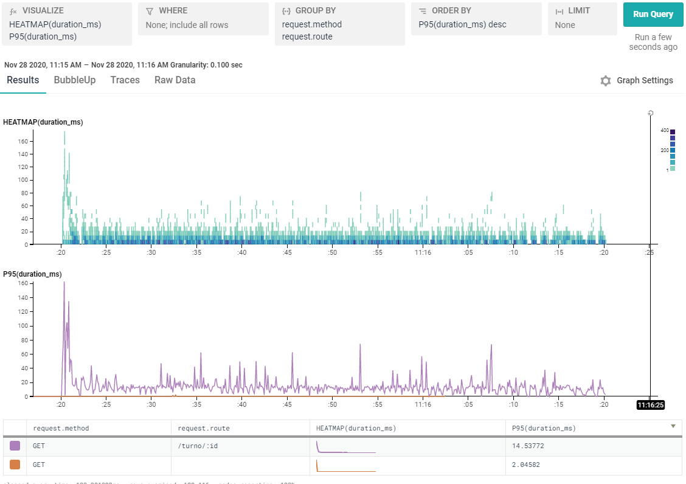
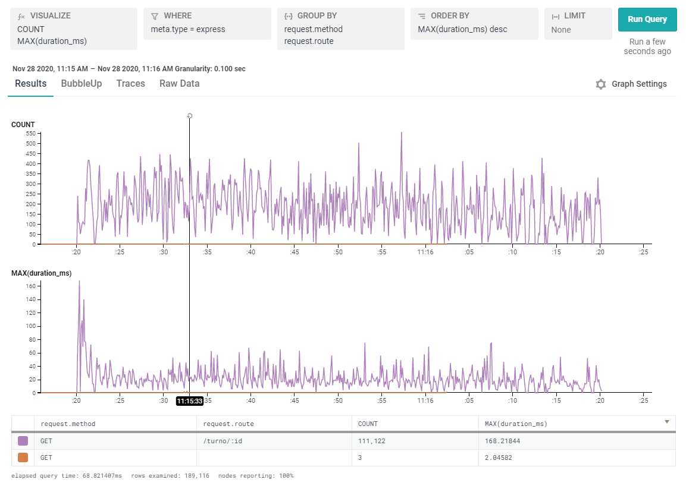

### Conclusiones

- Se observa un número de request constantes a lo largo de 2 minutos de alrededor de 5000 request por segundo

- En los monitores de recursos de las máquinas, vemos una utilizacion de CPU alta:

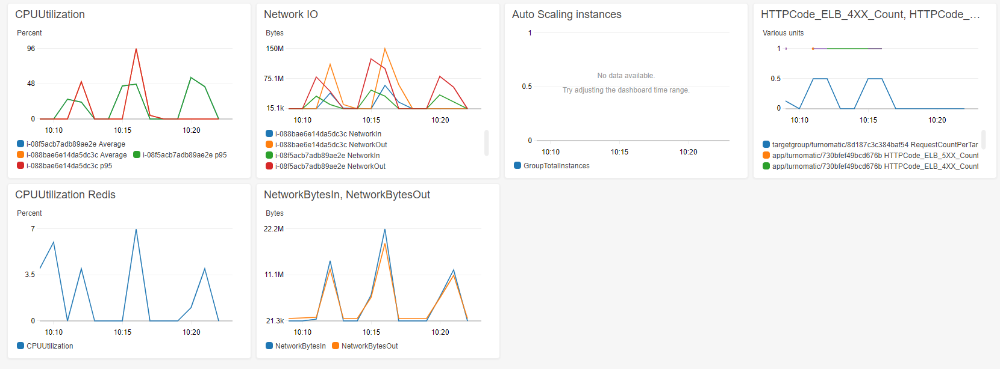

## Plan de acción

Como objetivos para resolver la incidencia tenemos:

1. Reducir el consumo de CPU de las máquinas
2. Aumentar el número de peticiones por segundo que nuestro sistema puede atender
    - Objectivo de negocio: _100k request/second_

Para conseguirlo se llevaran a cabo los siguientes cambios:

- **Pruebas con diferentes tipos de máquinas disponibles en AWS,** aumentando la capacidad de procesamiento del sistema
- **Se implementara un sistema de autoescalado basado en el consumo de CPU** del grupo de máquinas que componen la arquitectura.    
    - Número maximo de nodos: 10
    - _Threshold_ para creacion de nuevos nodos: media de 70% de utilizacion de CPU

### Primera implementacion: Mejora del tipo de máquina para los nodos web

- Hemos mejorado el tipo de maquina para los nodos web: _c5.large_. Caracteristicas:
    - 2 CPU's
    - 4 GB
    - No limitadas a _creditos_ de AWS

- Sistema de autoescalado limitado a 2 máquinas

`autocannon -c 100 -d 240 -p 10 http://turnomatic.com/turno/g4`

|Stat|1%|2.5%|50%|97.5%|Avg|Stdev|Min|
|-|-|-|-|-|-|-|-|
|Req/Sec|3729|4439|6719|6991|6630.8|485.48|3442

**AWS monitoring**
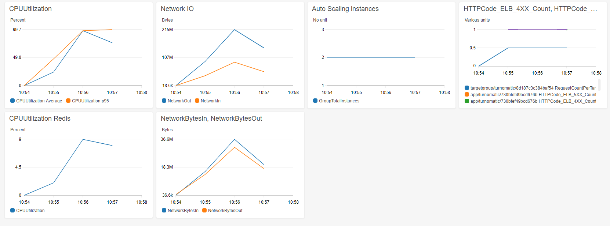
**Honeycomb results**
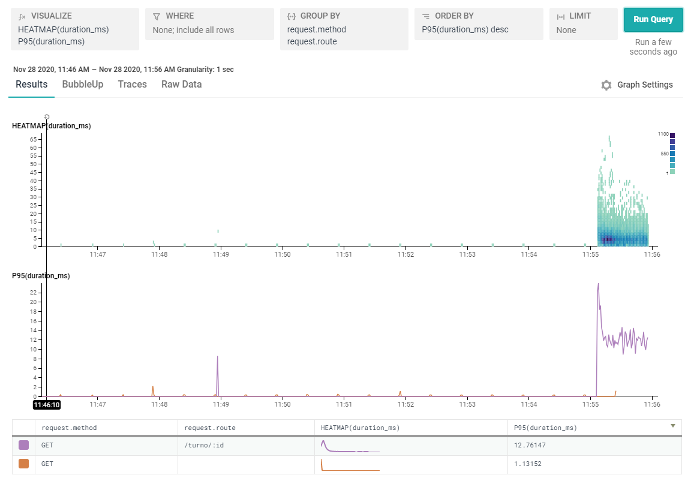
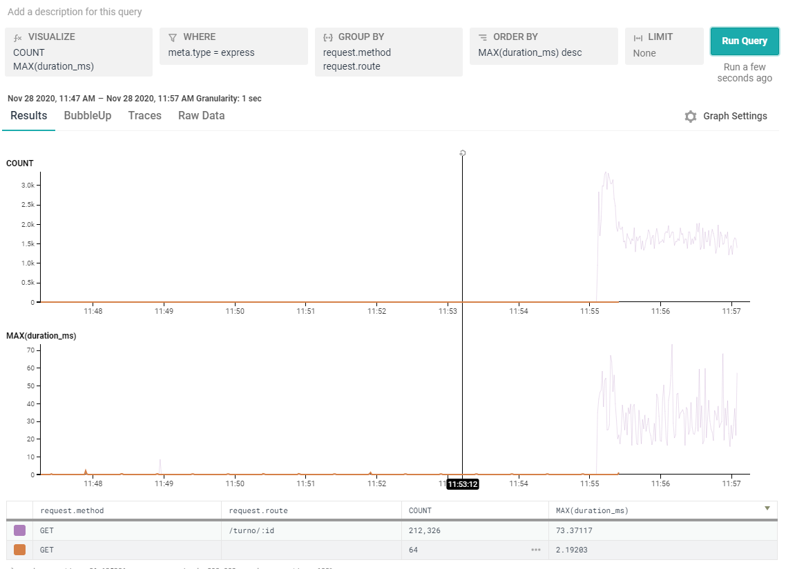

#### Conclusion

- Aumentamos el número  de request por segundo

- Se observa un uso alto de CPU en las 2 máquinas del sistema, llegando al 95% de uso de CPU en cada máquina


### Segunda implementacion: Mejora del tipo de máquina para los nodos web

- Sistema de autoescalado modificado: **aumenta el número de nodos disponibles a 10**

`autocannon -c 100 -d 240 -p 10 http://turnomatic.com/turno/g4`

|Stat|1%|2.5%|50%|97.5%|Avg|Stdev|Min|
|-|-|-|-|-|-|-|-|
|Req/Sec|16879|21503|23807|25119|23691.8 |1211.44 |14883


**AWS monitoring**
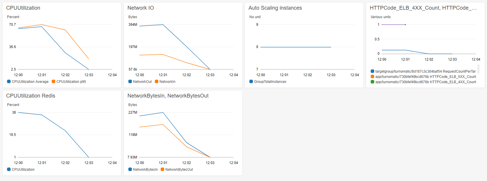
**Honeycomb results**
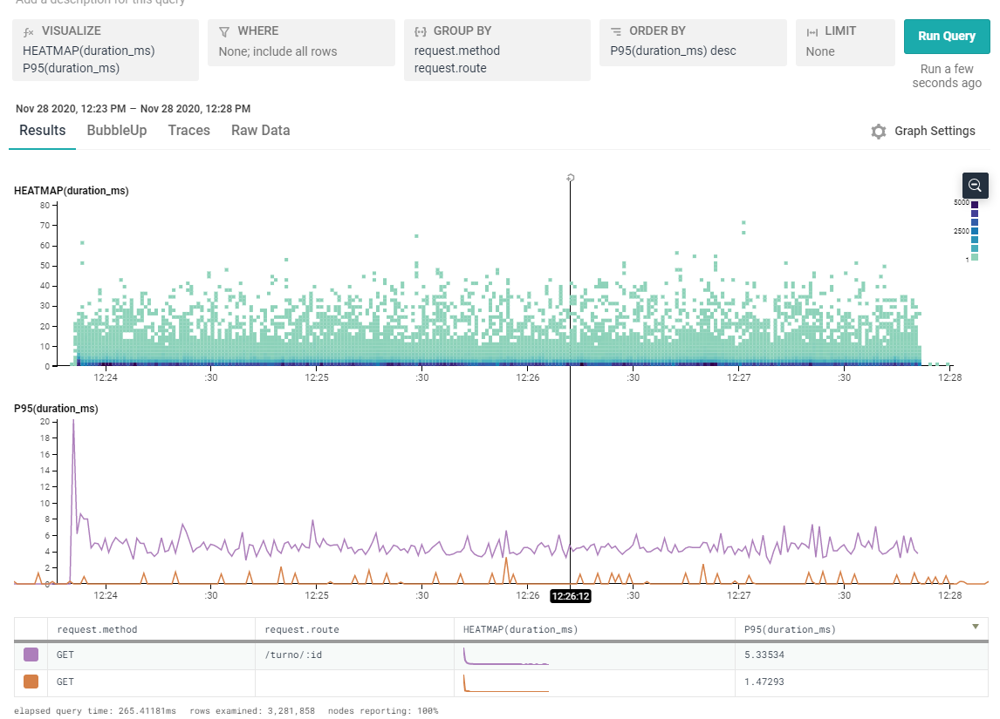
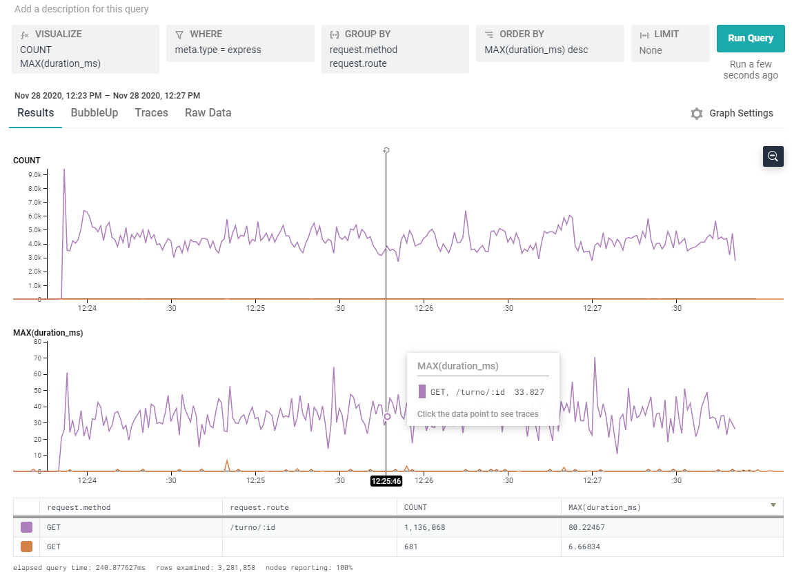

### Conclusion

- Se ha aumentado la capacidad del sistema en request por segundo

- Se han reducido los tiempos de respuesta de los _endpoint_ de la aplicación

- Se observa un uso alto de CPU a nivel del grupo completo de nodos, pero más bajo que en las pruebas anteriores, al 80%


## Tercera implementacion

- Cambio de CPU: _c5.xlarge_
- Nº de máquinas en el sistema: 8

`autocannon -c 100 -d 240 -p 10 http://turnomatic.com/turno/g4`

|Stat|1%|2.5%|50%|97.5%|Avg|Stdev|Min|
|-|-|-|-|-|-|-|-|
|Req/Sec|22159|22159|35647|37279|34139.47|3971.29|22154


**AWS monitoring**
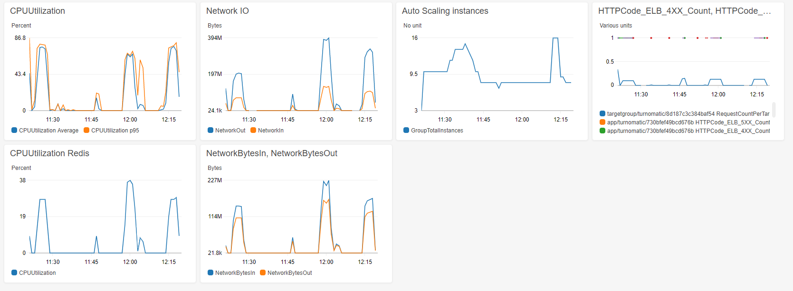
**Honeycomb results**
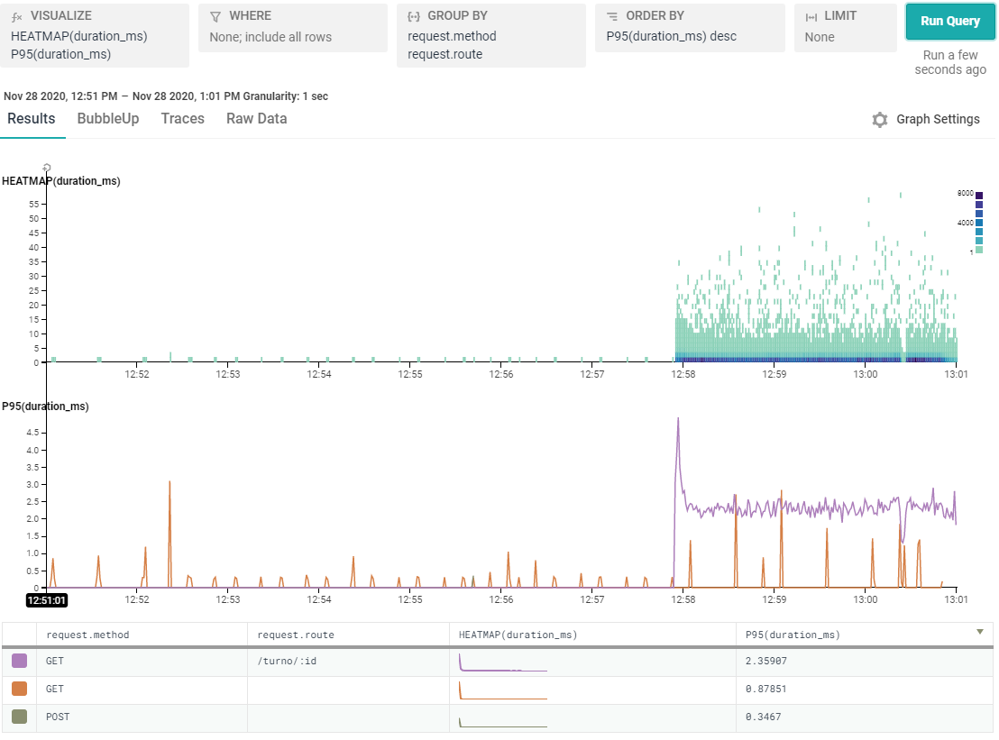
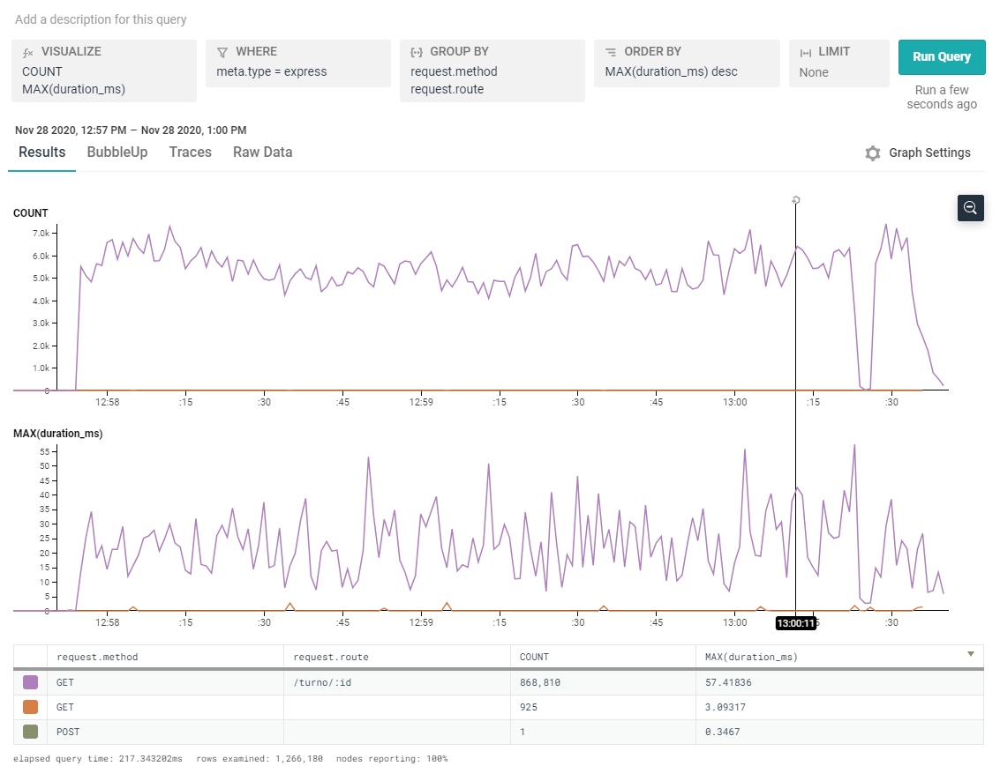

### Conclusion

- Aumentamos el número  de request por segundo con respecto a las pruebas anteriores
- Se han reducido los tiempos de respuesta de los _endpoint_ de la aplicación con respecto a las pruebas anteriores
- El consumo de CPU en el grupo de máquinas se ha reducido a 70%
- **Detectada una limitacion del sistema:**La cuenta de AWS utilizada tiene un limite de vCPU de 32. Esa es la razón por la cual en ésta prueba solo se han llegada a utilizar 8 nodos web


**NOTA ADICIONAL**

Resultados de las pruebas de carga realizadas a una sola instancia del tipo _c5.xlarge_

|Stat|1%|2.5%|50%|97.5%|Avg|Stdev|Min|
|-|-|-|-|-|-|-|-|
|Req/Sec|3193|3193|8495|9951|8132.64|1484.56|3192

# Sumario final de las pruebas

- El consumo de CPU se ha reducido en el grupo de escalabilidad en las últimas pruebas.
- A causa del limite de 32 vCPU de AWS, no es posible comprobar el rendimiento con un sistema con más de 8 nodos
- No obstante, teniendo en cuenta que en las últimas pruebas los nodos no se han saturado en cuanto a consumo de CPU, se concluye que **podría existir un cuello de botella en el balanceador web**.

# Acciones

1. Es necesario realizar cambios a nivel de la cuenta de AWS para poder hacer uso máximo de instances EC2 (máquinas virtuales) de mayor capacidad de computo
2. Es necesario llevar a cabo cambios en el sistema de balanceamiento web para aumentar el rendimiento en éste punto