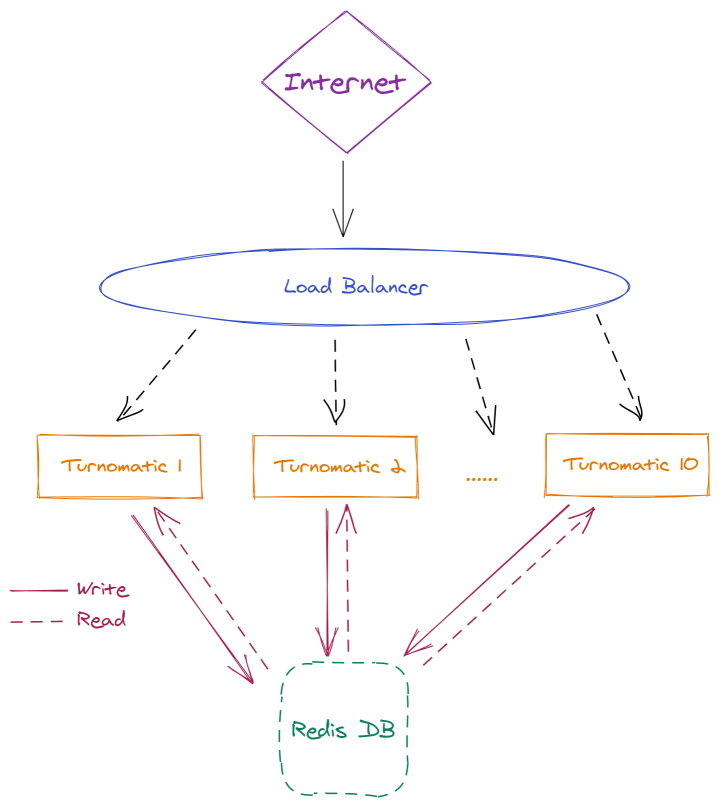

# Turnomatic

Sistema para la generación de números consecutivos para turnos de alta disponibilidad

# Implementacion

Desarrollo de una API web que consiste en un _end-point_ con las siguientes caracteristicas:

- **Request esperada**: url de la forma _http://turnomatic.com/turno/:group_id
    - Donde _group\_id_ será un identificador de grupo para generar su propio contador de turnos

- **Respuesta del sistema**: archivo formato _json_ con el nombre del grupo y el número de turno correspondiente. Ejemplo
    
```javascript
{
    "id": "Equipo 4"
    "turno": 1589
}
/*

id: String
turno: Number

*/
```

# Arquitectura del sistema




## Punto de entrada: Load Balancer

Balanceador web para redirigir las peticiones entrantes a los diferentes servidores web disponibles, ofreciendo alta disponibilidad y control de carga del sistema.

En esté punto se dispone de control para implementar sistema de _auto-escalado_ en casos en que el sistema comience a saturarse.

> Coste estimado mensual AWS: 68.38 USD

## Nodos Web (Turnomatic)

2 Maquinas virtuales AWS con las siguientes caracteristicas:

- Nombre comercial de instancia AWS: _t3.small_
- Procesador: 2 cores 
- Memoria: 2 GB
- Sistema Operativo: Ubuntu
- Almacenamiento: 8 GB

> Coste estimado mensual: 23.61 USD

El número de nodos inicial serán 2, con una implementacion de autoescalado (detalles de implementacion más adelante)

## Base de datos: Redis

Base de datos _in-memory_ de alto rendimiento implementada con [Redis](https://redis.io/)

Los diferentes nodos web harán uso de ésta base de datos para consultar/modificar el turno disponible para cada _group-id_.

Al ser una base de datos ejecutada en memoria, se dispone de un sistema de altor rendimiendo capaz de dar servicio rápido y fiable a cada una de las peticiones concurrentes de los diferentes nodos web.

Tipo de maquina en AWS: _m5.large_

> Coste estimado mensual AWS: 131.40 USD

## Coste total anual del sistema:

**2680.68 USD**

# Implementacion de autoescalado

Se ha configurado un _grupo de autoescalado_ con las siguientes caracteristicas:

- Número maximo de nodos: 10
- _Threshold_ para creacion de nuevos nodos: media de 70% de utilizacion de CPU


# Monitoring

**AWS**

- Media de uso de CPU
- Networking I/O
- Nº nodos creados
- Nº Instancias de Autoescalado
- Nº Errores HTTP 5XX y 4XX

**HoneyComb**

- Mapa de calor de tiempo de respuesta
- Tiempo de respuesta máximo
